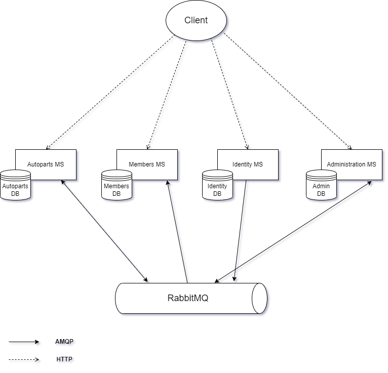

# Autoplace

The idea behind the app is to facilitate the sale and purchase of autoparts and allow buyers and sellers to interact with each other. Additionally, the sellers are able to build a reputation that can help them build trust with buyers.

## Distributed

The newer version of the app is with a distributed (microservice-based) architecture. I'm using the Eventual Consistency model and the Outbox pattern to keep data consistent with the help of RabbitMQ and Hangfire.

## Monolithic

The monolithic version of this app is quite old. I used the Data-Centric N-Layer architecture. I'm currently migrating it to the distributed architecture.
